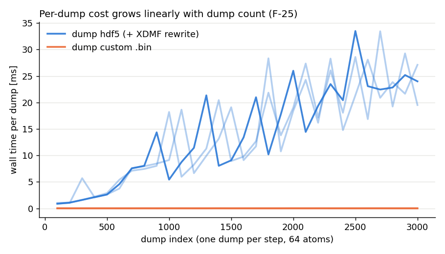
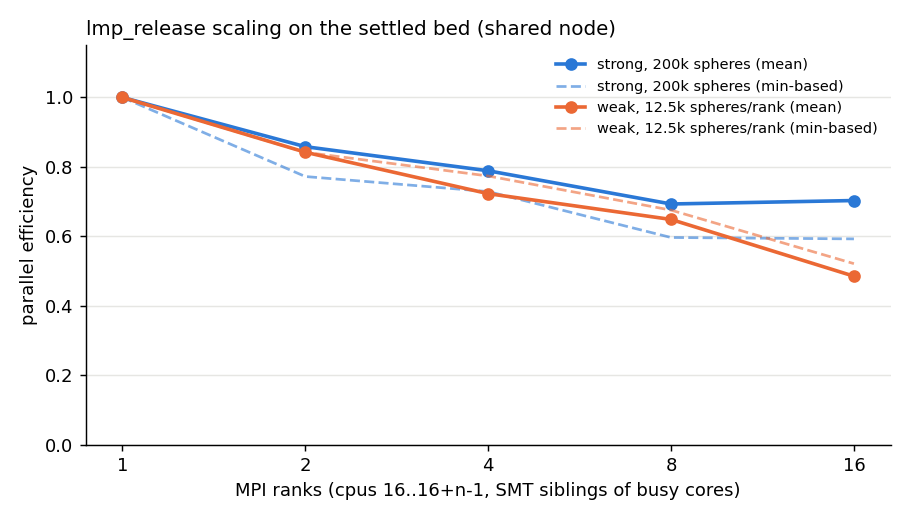

# 03 — Performance (Phase 3)

Status: complete for the items listed; skipped items in §9. Numbers are from 2026-09-29, one shared node.

Evidence labels used throughout: **[M]** measured (this campaign), **[VCI]** verified by code inspection,
**[H]** hypothesis requiring benchmark validation. GPU code is out of scope.

## 0. Environment and method

| Item | Value |
|---|---|
| CPU | AMD Ryzen 9 7950X, 16 cores / 32 threads, 2 CCDs (L3 32 MB each: cpus 0-7,16-23 and 8-15,24-31), 61 GiB RAM [M, `audit/logs/environment.txt`] |
| SMT topology | cpu *k* and cpu *k*+16 are **SMT siblings** (`thread_siblings_list`: 0,16 … 15,31). The prescribed cores 16-31 therefore share physical cores with 0-15. |
| Machine load | Shared machine. Besides the physics agent (cores 0-13), an unrelated 16-rank production run (`/home/n011/LIGGGHTS-PUBLIC/build/liggghts -in in.fillingdrum`, unpinned, started 09:32) was running during the whole campaign; load average 17-21 on 32 hw threads. |
| Compiler / MPI | GCC 11.4.0, Open MPI 4.1.2, HDF5 1.10.7 (parallel) |
| Binaries | `build_audit/bin/`: `lmp_release` (modified tree, 124-entry whitelist, `-DLIGGGHTS_HDF5`), `lmp_baseline` (pristine HEAD 3d5c00f2, 120-entry whitelist, **no HDF5**), `lmp_soa` (= release + `-DLIGGGHTS_USE_SOA_NVE`), `lmp_cmakedefault` / `lmp_baseline_cmakedefault` (4-combination CMake default whitelist). All: `-O2 -ffast-math -funroll-loops -fstrict-aliasing … -O3 -march=native -DNDEBUG -fno-fast-math -std=gnu++17` (the trailing `-fno-fast-math` cancels `-ffast-math`), Release, `ENABLE_VTK=OFF` [M, `build_audit/*/CMakeCache.txt`, `compile_commands.json`]. No `LD_LIBRARY_PATH` needed (system libs). |
| Profilers | `perf` is **unusable** (`kernel.perf_event_paranoid=4`, no root; `perf stat -e cycles:u` refused). No valgrind/VTune. Hardware counters (IPC, branch/cache misses) therefore **not measured**. Hot-spot tables come from a purpose-built SIGPROF sampler `audit/scripts/perf/sprof.c` (LD_PRELOAD, 2 kHz, flat, function level; binaries have symbols but no `-g`, so no line level). |
| Pinning | serial runs: `taskset -c <cpu>` with cpu ∈ 16-31; MPI runs: `mpirun --bind-to none audit/scripts/perf/pin.sh` (rank *r* → cpu 16+*r*; OpenMPI `--cpu-set 16-31 --bind-to core/hwthread` did not produce the requested masks). |
| Timing | LIGGGHTS end-of-run breakdown (Pair/Neigh/Comm/Outpt/Modfy/Other) with `modify_timing on` (adds per-fix times). Only the last `run` block of a deck is used (earlier blocks = settling). LIGGGHTS 3.8 prints only the rank-averaged category times (no min/avg/max); per-rank imbalance is taken from the `Nlocal`/`Neighs` min/avg/max histograms. |
| Design | Because the sequential A/B design on one cpu showed ±16-25 % run-to-run noise (`audit/logs/perf/t1_bed25k_sequential_cpu16/`), serial comparisons use a **paired-simultaneous** design (`bench.py:run_concurrent`): the variants run *at the same time* on distinct physical cores and the cpu assignment rotates every repetition; the reported statistic is the per-repetition paired ratio (mean ± std, 95 % t-CI) plus Welch p-value and ratio of minima. |
| Reproduction | decks `audit/cases/perf/{bed,drum,chute,gas,io}/`; drivers `audit/scripts/perf/{bench.py,analyze.py,t*.py}`; raw logs + `results.jsonl` in `audit/logs/perf/<campaign>/`. |

### Benchmark decks

| Deck | Content | Dominant cost [M] |
|---|---|---|
| `bed/in.bed` + `bed_{1x1,2x1,2x2,4x2,4x4}.restart` | settled bidisperse bed (r = 1.0/1.2 mm, ρ=2500, E=5 MPa), periodic x/y, primitive bottom wall, hertz + tangential history; 12.5k / 25k / 50k / 100k / 200k spheres (tiles 0.0416 m², box height 0.2 m). Generated by `bed/in.gen_tile` with `lmp_baseline` (20 000 steps). | Pair ≈ 90 % |
| `drum/in.drum` | thin rotating drum, STL with 2 560 triangles (`make_drum_stl.py`), 3 984 spheres, hertz/history, `fix move/mesh rotate`, 8 000 settle + 4 000 measured steps | Modify ≈ 53 % (neighlist/mesh, move/mesh, wall/gran), Pair ≈ 44 % |
| `chute/in.chute` | `Tutorials_public/chute_wear` without dumps (hertz/history, mesh/surface/stress + Finnie wear, insert/stream), 40 000 steps | Modify ≈ 65 %, Neigh ≈ 28 % |
| `gas/in.gas` | 205k non-contacting spheres, plain `fix nve` | integration |
| `gas/in.gas_adapt` | 24k spheres, radius growth by `fix adapt/liggghts` or legacy `fix adapt` | Neigh |
| `io/in.io`, `gas/in.gas_io` | dump hdf5 / dump custom (text, `.bin`) | Output |

`benchmarks/manifests/baseline_smoke.yaml` names the tutorial decks (packing, meshGran, cohesion, superquadric).
They are insertion/growth tutorials whose cost is dominated by setup at the lengths used in
`audit/logs/examples_*.csv` (≈0.5 s); the `bed`/`drum`/`chute` decks above are the steady-state equivalents
(packing → bed, meshGran → drum/chute). Superquadric is not in either whitelist-built binary's tested set
(`examples_lmp_release.csv`: "Invalid atom style"), so it is skipped.

## 1. Baseline (pristine HEAD) vs modified — identical decks, np = 1 [M]

Physics check: the final thermo line (step, atoms, KE[, erot]) is identical to all printed digits between
`lmp_baseline` and `lmp_release` for all three decks; neighbor-build counts are identical (13 / 38 / 778).

| Deck (steps measured) | n | loop, baseline | loop, release | paired ratio release/baseline (95 % CI) | Welch p | ratio of minima |
|---|---|---|---|---|---|---|
| bed 25k, pair-dominated (2 000) — 2 concurrent paired streams, cpus 20-23 | 16 | 14.43 ± 2.0 s (min 10.36) | 14.70 ± 2.0 s (min 10.24) | 1.040 ± 0.225 [0.920, 1.160] | 0.72 | **0.988** |
| bed 25k, earlier campaign on cpus 30/31 | 10 | 16.44 ± 8.6 s (min 9.78) | 16.26 ± 7.2 s (min 9.99) | 1.044 ± 0.250 [0.866, 1.223] | 0.96 | 1.022 |
| drum, mesh-dominated (4 000) | 8 | 4.237 ± 0.034 s (min 4.168) | 4.210 ± 0.027 s (min 4.151) | **0.994 ± 0.010 [0.985, 1.002]** | 0.10 | 0.996 |
| chute_wear (no dumps, 40 000) | 8 | 5.562 ± 0.16 s (min 5.341) | 5.667 ± 0.16 s (min 5.430) | 1.020 ± 0.044 [0.983, 1.057] | 0.21 | 1.017 |

Category breakdown (paired ratio release/baseline, 95 % CI):

| Deck | Pair | Neigh | Comm | Modify |
|---|---|---|---|---|
| bed 25k (n = 16) | 1.039 [0.921, 1.157] | 0.998 [0.933, 1.063] | 1.134 [0.910, 1.359] | 1.033 [0.900, 1.166] |
| drum (n = 8) | 0.996 [0.986, 1.005] | 1.004 [0.965, 1.044] | 1.009 [0.977, 1.041] | 0.992 [0.982, 1.001] |
| chute (n = 8) | 1.007 [0.989, 1.026] | 1.007 [0.925, 1.090] | **1.119 [1.071, 1.167], p = 2e-4** | 1.022 [0.986, 1.058] |

Per-fix self times (paired ratio, n = 8): drum `wall/gran` **0.961 ± 0.019** (release 3.9 % faster),
`neighlist/mesh` 1.011 ± 0.023, `move/mesh` 0.990 ± 0.022; chute `wall/gran` **1.060 ± 0.015** (release 6 %
slower), `neighlist/mesh` 1.018 ± 0.070, `mesh/surface/stress` 1.001 ± 0.007.

**Verdict.** No difference of the modified tree against HEAD is significant at the whole-run level. The resolution is
±1 % on the drum, ±4 % on the chute and only ±12 % on the pair-dominated bed (the bed is the most sensitive to the
shared machine; min-of-n agrees within 1-2 %). The only significant category-level effects are small and have
opposite signs: chute Comm +12 % (0.025 s of 5.6 s, 0.4 % of the run; nothing in the diff touches `Comm`, so this is
attributed to code-layout/alignment changes [H]) and `fix wall/gran` −3.9 % (drum) vs +6.0 % (chute) — each ≤ 0.8 %
of the loop, and opposite in sign on two mesh decks, so they are **not** a reproducible gain from the hoisting [M].

## 2. Micro-optimisations: measurable? vectorisable?

`perf stat`/`perf record` could not be used (see §0); IPC / branch-miss / cache-miss counters are **not measured**.
Hot-spot tables below come from `sprof.so` (CPU-time sampling at 2 kHz, one run each, cpus 30/31;
`audit/logs/perf/profiles/summary.md`).

**Bed 25k (pair-dominated), % of samples [M]**

| Function | baseline | release |
|---|---|---|
| `PairStyles::Granular<…GranStyle<3,2,0,0,0>>::compute_force` (pair loop, inlined tangential/rolling) | 52.9 | 55.6 |
| `NormalModel<HERTZ>::surfacesIntersect` (out of line!) | 22.8 | 20.1 |
| `TangentialModel<HISTORY>::surfacesIntersect` (out of line) | 12.0 | 12.3 |
| `FixNVESphere::initial+final_integrate` | 4.6 | 5.0 |
| `Neighbor::granular_bin_no_newton` | 1.9 | 1.6 |
| `FixGravity::post_force` | 1.5 | 1.4 |
| `Neighbor::check_distance` | 1.1 | 1.1 |
| `FixContactHistory::pre_exchange` | 0.26 | 0.27 |

**Drum (mesh-dominated), % of samples [M]**

| Function | baseline | release |
|---|---|---|
| `FixNeighlistMesh::checkBin` | 19.2 | 19.2 |
| pair `compute_force` | 18.6 | 19.8 |
| `NormalModel<HERTZ>::surfacesIntersect` | 9.9 | 7.6 |
| `GeneralContainer<double,3,3>::rotate` + `MultiNodeMesh<3>::rotate` (move/mesh) | 12.6 | 12.0 |
| `FixNeighlistMesh::handleTriangle` | 5.5 | 8.0 |
| `FixWallGran::post_force_mesh` | 5.0 | 4.9 |
| `MultiNodeMesh<3>::updateGlobalBoundingBox` | 2.5 | 2.5 |

(The shift of a few % between `surfacesIntersect`, `compute_force` and `handleTriangle` is an inlining difference
between the two builds, not a cost change — the category times in §1 are equal.)

**Vectorisation** (`-fopt-info-vec-missed`, single-TU recompiles with the exact `compile_commands.json` flags,
`audit/scripts/perf/vec/`) [M]:

* The pair loops `pair_gran_base.h:254` (ii) and `:275` (jj) are **not vectorised in either tree**, for the same
  reasons: "loop nest containing two or more consecutive inner loops cannot be vectorized" (117/124 instantiations
  release, 116/120 baseline) and, inside the body, "statement clobbers memory: `r = sqrt(rsq)`"
  (`pair_gran_base.h:359` release / `:357` baseline): with `-fno-fast-math` GCC keeps `errno` semantics
  (`-fmath-errno`), so every `sqrt` is a potential library call with side effects.
* `tangential_model_history.h`: no loop; the squared Coulomb test removes one `sqrt` only on the stick branch.
* `fix_wall_gran.cpp`: 32 loops vectorised in both trees (91 vs 92 missed); `fix_neighlist_mesh.cpp`: 9 vectorised,
  24 missed in both. The hoisting and the `checkBin` rewrite do not change a single vectorisation decision.

**Verdict per micro-optimisation**

| Change | Correct? (02a/02b) | Measured effect | Vectorisation | Verdict |
|---|---|---|---|---|
| sqrt avoidance, `tangential_model_history.h:161-183` / `no_history` | yes (ulp-level tie flips, C-11/C-12) | none detectable: bed Pair ratio 1.039 [0.92, 1.16], min-ratio 0.989; drum Pair 0.996 [0.986, 1.005] | none possible (scalar, branchy) | **no measurable gain**; keep only because it is already validated; do not extend |
| hoist `x[j][*]` loads, `pair_gran_base.h:278-283` | bitwise identical | none (same Pair time; the compiler already did this — same `-fopt-info` output) | unchanged | **cosmetic** |
| hoisting in `fix_wall_gran.cpp` (`fix_mesh`, `sidata.mesh`, `idTri`) | yes + latent fix (credit) | `wall/gran` −3.9 % (drum) / +6.0 % (chute), opposite signs, ≤ 0.8 % of loop | unchanged (32 vectorised both) | **neutral**; keep for the latent `sidata.fix_mesh` fix, not for speed |
| `checkBin` null-check removal + `nextAtom` caching | yes (+ undocumented `>=nlocal` fix, F-20) | `neighlist/mesh` 1.011 ± 0.023 (drum), 1.018 ± 0.070 (chute); `checkBin` 19.2 % of samples in both | unchanged | **no gain** (the branch was perfectly predicted) |
| direct `incrementPackedInt` | yes | not separable (inside `checkBin`/`handleTriangle`; see above) | n/a | **neutral** |
| dump/compute `*_component()` accessors | yes | zero (02b: identical object code) | n/a | neutral dead abstraction |

Where the real single-core headroom is [H, from the profiles]: `NormalModel<HERTZ>::surfacesIntersect` and
`TangentialModel<…>::surfacesIntersect` are **out-of-line calls per contact** (35 % of samples together);
forcing inlining (`__attribute__((always_inline))` or `inline` + LTO) and `-fno-math-errno` are the first
things to try, followed by OpenMP threading of the pair loop (S-08). In the drum, `checkBin` (19 %) and the
mesh rotation (12 %) dominate, i.e. the mesh neighbour list and the mesh mover, not the wall force.

## 3. SoA path (`LIGGGHTS_USE_SOA_NVE`, `src/aligned_particle_soa.h`, `src/fix_nve.cpp:98-111,158-171`)

Only plain `fix nve` uses the SoA path [VCI, 02b §3]; `nve/sphere` (every DEM deck here) is untouched. Both
decks below therefore use `fix nve`.

**In situ, `lmp_soa` vs `lmp_release`, paired-simultaneous, n = 6 [M]** (`audit/logs/perf/t3_soa_*`)

| Deck | `fix integr` time, SoA | `fix integr` time, AoS (release) | paired ratio SoA/AoS | loop-time ratio (95 % CI) |
|---|---|---|---|---|
| gas, 205 379 non-contacting spheres, 500 steps | 8.54 ± 0.56 s (min 7.68) | 1.50 ± 0.11 s (min 1.37) | **5.70 ± 0.42** | 3.42 [3.22, 3.63], p = 1e-7 |
| bed 25k (contact-rich), 2 000 steps | 0.824 ± 0.127 s (min 0.684) | 0.279 ± 0.057 s (min 0.224) | **3.04 ± 0.72** | 1.04 [0.84, 1.24] (Pair dominates; n.s.) |

**Micro-benchmark of the header itself** (`audit/scripts/perf/soa_micro.cpp`, header included verbatim, cpu 29,
5 × runs, ns per atom per full step = initial + final integrate) [M] (`audit/logs/perf/soa_micro*.txt`):

| N | SoA path total | of which AoS↔SoA copies | SoA kernels alone | AoS in-place loop | SoA/AoS |
|---|---|---|---|---|---|
| 12 544 (in L2/L3) | 14.53 ± 0.03 | 71.6 % | 4.17 | 5.05 ± 0.02 | 2.88 |
| 200 704 | 67-100 (load-dependent) | 85-92 % | 8.4 | 9.0 | 6.0-11.1 |
| 2 000 000 | 103.0 ± 1.1 | 91 % | 9.2 | 10.3 ± 0.2 | 10.0 |

Even the SoA *kernels alone* are only 10-20 % faster than the whole AoS loop (they are not vectorised:
"control flow in loop", 02b §3), and the copies (`load_from_aos` rebuilds all 10 arrays including `x` and
`1/m` on *both* half-steps) cost 3-10× that. There is no regime in which the path can pay off.
**Verdict: DELETE** (agrees with F-15, S-14). Acceptance: smoke manifest bitwise identical with the macro off
(it is off by default, so deletion is behaviour-neutral) and `nve/sphere` time unchanged.

## 4. Cost of the new features

### 4a. `fix property/global … v_ … every N` [M] (`audit/logs/perf/t4a_propglobal_bed12k`)

Bed 12.5k, 3 000 steps, `coefficientRestitution` 2×2 matrix given as `v_cor` (4 variable evaluations per update).
The fix's own time comes from `modify_timing` (per-fix line):

| Variant | `fix m3` self time per step | loop time (n = 6) | paired loop ratio vs const (95 % CI) |
|---|---|---|---|
| literal values | 0.00004 µs | 8.93 ± 1.9 s | 1 |
| `v_cor every 1` | **3.3 µs** | 8.94 ± 1.8 s | 1.03 [0.76, 1.29] |
| `v_cor every 100` | **0.36 µs** | 8.89 ± 1.5 s | 1.01 [0.88, 1.13] |

`every 100` costs 0.36 µs/step instead of the 0.033 µs expected from 3.3/100: about 0.3 µs/step is spent on steps
where nothing is evaluated (end_of_step entry + `ensure_variable_values_initialized` scan) [M + VCI]. All values are
≤ 0.1 % of a 3 ms step: **negligible**. (The feature is functionally a no-op for contact models, F-01/C-01 — the
performance question is moot until that is fixed; re-measure then, because the fix will have to push values into
the registry/`mixingRule` tables.)

### 4b. `fix adapt/liggghts` and `Neighbor::trigger_build()` [M] (`audit/logs/perf/t4b_adapt_dr*`)

`gas/in.gas_adapt`: 24 389 spheres, skin 1 mm (trigger threshold 0.5 mm), radius += dr every 50 steps, 400 steps,
n = 6, 4 variants run simultaneously.

| dr per application | variant | neighbor builds | dangerous builds | Neigh time | loop time |
|---|---|---|---|---|---|
| 0.3 mm (< threshold) | none | 0 | 0 | 0 | 0.181 ± 0.005 s |
| | adapt/liggghts (release) | 4 | 0 | 0.299 ± 0.034 s | 0.495 ± 0.039 s |
| | legacy `fix adapt` (release) | 4 | 0 | 0.308 ± 0.018 s | 0.501 ± 0.027 s |
| | legacy `fix adapt` (baseline) | 4 | 0 | 0.298 ± 0.037 s | 0.496 ± 0.041 s |
| 0.6 mm (> threshold) | none | 0 | 0 | 0 | 0.177 ± 0.007 s |
| | adapt/liggghts (release) | 8 | **0** | 0.509 ± 0.032 s | 0.708 ± 0.033 s |
| | legacy `fix adapt` (release) | 8 | **1** | 0.504 ± 0.030 s | 0.705 ± 0.030 s |
| | legacy `fix adapt` (baseline) | 8 | **1** | 0.520 ± 0.027 s | 0.718 ± 0.031 s |

The forced rebuilds are **not extra**: the legacy rhold-aware displacement check (`neighbor.cpp` `check_distance`)
rebuilds on exactly the same steps; `trigger_build()` only moves the super-threshold rebuild one step earlier and
thereby avoids the one "dangerous build" that legacy `fix adapt` produces. The fix's own cost is 2.5-2.8 ms per
400 steps (≈ 7 µs/step for 24k atoms, same as legacy). **Verdict: no performance cost; small robustness gain
(credit)** — but the trigger is rank-local (F-02, MPI deadlock) and does not enlarge bins/ghost cutoff (F-03).

### 4c. Output: `dump hdf5` vs `dump custom` (text / binary) and XDMF growth [M] (`audit/logs/perf/t4c_io.jsonl`, `t4c_io/`)

VTK dump styles are not available (`ENABLE_VTK=OFF`; `lmp_release -h` lists no `custom/vtk`), so VTK is **skipped**.
`lmp_baseline` has no HDF5, so HDF5 is release-only. Bed 25k, 500 steps, dump every 10 steps (51 dumps), same
14 columns (id, x, v, f, ω, r); output to `/media/storage` (ext4, page cache warm; not an `fsync`ed bandwidth).
n = 5 each; MB/s = file bytes / `Outpt` time.

| ranks | format | bytes | Outpt time | per dump | throughput (mean / best) |
|---|---|---|---|---|---|
| 1 | dump hdf5 | 144.3 MB | 0.220 ± 0.031 s | 4.3 ms | 654 / 845 MB/s |
| 1 | dump custom text | 181.6 MB | 2.51 ± 0.50 s | 49 ms | 72 / 89 MB/s |
| 1 | dump custom `.bin` | 143.3 MB | 0.145 ± 0.018 s | 2.8 ms | 990 / 1 247 MB/s |
| 4 | dump hdf5 (collective MPI-IO) | 144.3 MB | 0.468 ± 0.054 s | 9.2 ms | 308 / 377 MB/s |
| 4 | dump custom text | 181.6 MB | 1.90 ± 0.36 s | 37 ms | 96 / 121 MB/s |
| 4 | dump custom `.bin` | 143.3 MB | 0.265 ± 0.042 s | 5.2 ms | 541 / 660 MB/s |

HDF5 is 11× faster than text `dump custom`, but ≈ 1.5-1.8× **slower** than LIGGGHTS' own binary `dump custom`
at 1 and 4 ranks on one node, and it gets slower (not faster) from 1 → 4 ranks (collective open/close, 6 dataset
creations and the XDMF rewrite per dump). Multi-node collective-I/O scaling was not testable (single node) — skipped.

**XDMF sidecar growth (F-25).** 64-atom system, one dump per step, 3 000 dumps (`gas/in.gas_io`, n = 3):
wall time per dump rises **linearly from 0.9-1.0 ms (first 100 dumps) to 20-27 ms (dumps 2 900-3 000)**; total
42.2 ± 0.1 s for `dump hdf5` vs 0.036 ± 0.002 s for `dump custom .bin` (1 170×). The final `.xdmf` is 3.69 MB
(1.23 kB per grid), so the run rewrote Σ ≈ 3 000²/2 × 1.23 kB ≈ 5.5 GB of XDMF text. A profile of that run
(`profiles/xdmf_hdf5`) attributes 90 % of CPU samples to libc (formatting + `write`) and only 6 % to libhdf5, and
only 7 s of the 42 s are CPU time at all — the rest is I/O wait. The HDF5 file itself is 81 MB for 13.6 MB of
payload (per-step groups/datasets: ≈ 3.8× metadata overhead).
Plot: `audit/plots/perf/xdmf_growth.png`. **F-25 is confirmed as measured**: for the tutorial's 2 000 dumps
the sidecar alone costs ~10-15 s and ~2.6 GB of writes; for long production runs it becomes the dominant cost.
Fix: append one `<Grid>` per dump (keep the file open or seek before the closing tags), or write the XDMF once at
the end/at restart; keep one HDF5 file open between dumps.

## 5. Scaling (lmp_release, MPI only, one node) [M]

Ranks are pinned to cpus 16 … 16+n−1, which are the SMT siblings of cores 0 … n−1; those cores were busy with the
physics agent and the unrelated 16-rank job for the whole campaign. The numbers are therefore a **lower bound** for a
dedicated node, and the 1-rank reference itself varies (strong np = 1: 15.7-25.0 s). n = 5 per point; efficiency
is given from means and from minima. `processors * * 1` (x-y decomposition matching the periodic bed) unless noted.
"Other" = loop − timed categories; it contains the untimed collective in `Neighbor::decide()`/`check_distance`
(MPI_Allreduce per step) and therefore absorbs synchronisation wait [VCI `verlet.cpp`, `src/verlet.cpp:299`, `src/neighbor.cpp:1473`].
Strong 200k: Other 1.5 / 9.7 / 15.2 / 23.5 / 20.2 % at 1/2/4/8/16 ranks; weak: 1.3 / 5.1 / 12.6 / 16.1 / 21.9 %.

#### t5_strong_200k

| ranks | atoms | loop (mean ± std, min) | speedup / eff. (mean) | eff. (min-based) | Pair % | Comm % | Neigh % | Modify % | Nlocal max/avg | Neighs max/avg | mem/proc MB |
|---|---|---|---|---|---|---|---|---|---|---|---|
| 1 | 200704 | 20.11 ± 4.19 (15.71) | 1.00 / 1.00 | 1.00 | 88.5 | 0.8 | 1.2 | 7.9 | 1.00 | 1.00 | 136.975 |
| 2 | 200704 | 11.71 ± 1.12 (10.17) | 1.72 / 0.86 | 0.77 | 81.3 | 1.8 | 1.1 | 6.1 | 1.00 | 1.00 | 72.8906 |
| 4 | 200704 | 6.37 ± 0.57 (5.39) | 3.15 / 0.79 | 0.73 | 75.3 | 2.6 | 1.0 | 5.8 | 1.00 | 1.00 | 40.2337 |
| 8 | 200704 | 3.63 ± 0.23 (3.29) | 5.54 / 0.69 | 0.60 | 63.3 | 5.6 | 0.9 | 6.7 | 1.00 | 1.00 | 23.8266 |
| 16 | 200704 | 1.79 ± 0.18 (1.66) | 11.25 / 0.70 | 0.59 | 66.2 | 7.5 | 1.0 | 5.1 | 1.00 | 1.01 | 13.5602 |

#### t5_weak_12k

| ranks | atoms | loop (mean ± std, min) | speedup / eff. (mean) | eff. (min-based) | Pair % | Comm % | Neigh % | Modify % | Nlocal max/avg | Neighs max/avg | mem/proc MB |
|---|---|---|---|---|---|---|---|---|---|---|---|
| 1 | 12544 | 2.98 ± 0.04 (2.94) | – / 1.00 | 1.00 | 90.2 | 1.1 | 1.1 | 6.4 | 1.00 | 1.00 | 12.4299 |
| 2 | 25088 | 3.54 ± 0.05 (3.49) | – / 0.84 | 0.84 | 85.3 | 1.8 | 1.9 | 5.9 | 1.01 | 1.01 | 12.8685 |
| 4 | 50176 | 4.12 ± 0.34 (3.80) | – / 0.72 | 0.77 | 77.1 | 3.0 | 1.9 | 5.3 | 1.01 | 1.01 | 12.9841 |
| 8 | 100352 | 4.59 ± 0.17 (4.35) | – / 0.65 | 0.68 | 72.8 | 4.2 | 1.5 | 5.4 | 1.00 | 1.01 | 13.1754 |
| 16 | 200704 | 6.14 ± 0.91 (5.63) | – / 0.49 | 0.52 | 64.0 | 7.8 | 1.2 | 5.0 | 1.00 | 1.01 | 13.5602 |

#### t5_imbalance_200k

| ranks | variant | loop (mean ± std, min) | Pair % | Comm % | Nlocal max/avg (min) | Neighs max/avg | mem/proc MB |
|---|---|---|---|---|---|---|---|
| 8 | release_auto | 5.43 ± 0.15 (5.28) | 37.3 | 1.4 | 2.00 (0) | 2.00 | 37.6167 |
| 8 | release_pz1 | 2.99 ± 0.07 (2.89) | 67.4 | 5.8 | 1.00 (25042) | 1.00 | 23.8266 |
| 8 | baseline_auto | 5.36 ± 0.07 (5.28) | 37.6 | 1.4 | 2.00 (0) | 2.00 | 37.6167 |
| 16 | release_auto | 4.34 ± 0.15 (4.22) | 28.7 | 2.4 | 2.87 (0) | 2.87 | 27.8643 |
| 16 | release_pz1 | 1.72 ± 0.07 (1.63) | 68.2 | 7.0 | 1.00 (12514) | 1.01 | 13.5602 |
| 16 | baseline_auto | 4.39 ± 0.09 (4.28) | 28.7 | 2.3 | 2.87 (0) | 2.87 | 27.8643 |

* **Strong scaling** 200k: speed-up 11.3× on 16 ranks (efficiency 0.70 from means, 0.59 from minima); Comm grows
  from 0.8 % to 7.5 %, the synchronisation wait (Other) to ≈ 20 %. Particle and pair-work balance is perfect
  (Nlocal and Neighs max/avg ≤ 1.01), so the loss is communication + wait under the shared-node noise, not static
  imbalance.
* **Weak scaling** 12.5k/rank: efficiency 0.84 / 0.72 / 0.65 / 0.49 at 2/4/8/16 ranks. At 16 ranks every physical
  core is shared with another busy thread, so this curve mostly measures the node, not LIGGGHTS [H]; the
  communication share alone (7.8 %) would allow ≈ 0.9.
* **Neighbour-list/contact memory**: "Memory usage per processor" 137 MB for 200k atoms on 1 rank (≈ 680 B/atom
  incl. neighbour pages and history), 12.4-13.6 MB per rank for 12.5k atoms (weak), i.e. ghost overhead ≤ 10 % at
  16 ranks. With history the per-proc memory doubles vs no_history (21.4 vs 10.2 MB for 25k, §6).
* **Static-decomposition imbalance (S-05)**: same 200k bed, same binary, only the processor grid changes. The
  default `processors * * *` picks 2×2×2 (8 ranks) / 2×2×4 (16 ranks) because the box is 0.166×0.166×0.2 m, but the
  settled bed fills only the lower ≈ 55 % — half (8 ranks) or 8 of 16 ranks own **zero** particles (Nlocal
  max/avg 2.00 and 2.87, min 0). Result: loop **5.43 ± 0.15 s vs 2.99 ± 0.07 s (1.82× slower) at 8 ranks** and
  **4.34 ± 0.15 s vs 1.72 ± 0.07 s (2.52× slower) at 16 ranks**; the idle ranks' wait shows up as Other 57-66 %.
  `lmp_baseline` behaves identically (5.36 / 4.39 s), so this is legacy, not a regression. A hand-chosen grid
  fixes this static case; hoppers, chutes and insertion streams whose particle distribution changes in time need
  dynamic balancing (S-05: `balance`/`fix balance` shift with contact-count weights) — the 1.5-3× estimate in
  05 §2.2 is consistent with the measured 1.8-2.5×.
* The chute/chute_wear_hpc decks were not scaled: they hold ≤ 1 200 particles (chute_wear_hpc: 701 at the end), far
  below one rank's worth of work; np = 2/4 smoke runs exist (`audit/cases/smoke/lmp_release__chute_wear_np{2,4}`).

## 6. Contact-history transfer cost (S-07) [M]

Dense bed 25k, **forced rebuild every step** (`neigh_modify every 1 check no`, 1 000 steps, 1 000 builds) — the
worst case for history transfer — `tangential history` vs `tangential no_history`, paired-simultaneous, n = 6:

| | Neigh | `fix contacthistory` (pre_exchange etc.) | loop | memory/proc |
|---|---|---|---|---|
| no_history | 12.73 ± 1.1 s (min 11.77) | — | 19.29 ± 2.1 s | 10.2 MB |
| history | 14.32 ± 1.0 s (min 13.46) | 2.41 ± 0.30 s | 23.55 ± 2.2 s | 21.4 MB |
| difference | **+1.6 s = 1.6-1.7 ms / build (+12-15 % of Neigh)**; Neigh ratio 1.15 [0.97, 1.33], p = 0.016 | **+2.4 ms / build** | +4.3 s | +11 MB |

Profile of the history run (`profiles/t6_history`): `granular_bin_no_newton` 52 % (geometric search *and* the inline
partner scan `neigh_gran.cpp:590-593`), `FixContactHistory::pre_exchange` 10.5 %, pair 30 %. Mean partners per atom
≈ 4.9 (123 400 neighbours / 25 088 atoms), so the linear scan touches ~5 ints per candidate.

In a normal run the bed rebuilds 13 times per 2 000 steps: Neigh is 1.4 % and `pre_exchange` 0.27 % of the
samples, so the whole history transfer is **≈ 0.3-0.5 % of the loop**. Even with a rebuild every step the part a
sorted merge could remove (the scan, a fraction of the +1.6 ms) is < 7 % of the loop, and the larger share
(`pre_exchange` copying, +2.4 ms) would not change with a sorted table. **Verdict: not a hotspot — confirms
05 §2.2 (S-07 "measure first") and refutes the evaluation report's ranking of a CSR/hash index as a cheap
high-value win.** Keep the linear scan; add the counters only if a cohesive/polydisperse case with Z ≫ 10 appears.

## 7. Build time and binary size vs whitelist size [M]

| Build | whitelist entries | `lammps.cpp` compile (single TU, cpu 24/25, n = 3) | `lammps.cpp.o` text | peak RSS | binary text (`size`) |
|---|---|---|---|---|---|
| lmp_release | 124 | 44.2 ± 3.0 s | 3.24 MB | 753 MB | 9.84 MB (file 11.94 MB) |
| lmp_cmakedefault | 4 | 3.7 ± 0.5 s | 0.21 MB | 335 MB | 6.56 MB (file 7.46 MB) |
| lmp_baseline | 120 | 39.4 ± 2.1 s | 3.18 MB | 740 MB | 9.73 MB (file 11.79 MB) |
| lmp_baseline_cmakedefault | 4 | 5.1 ± 0.2 s | 0.37 MB | 342 MB | 6.69 MB (file 7.62 MB) |

All contact-model templates (pair *and* wall) are instantiated in the single TU `lammps.cpp` (via
`granular_styles.h:105` → `style_contact_model.h`), ≈ 0.33 s of compile time and ≈ 26 kB of text per combination.
Because it is one TU it is the **critical path of a parallel build**: the full `lmp_release` build ran from 11:00:59
to 11:01:51 (52 s wall, object mtimes), i.e. ≈ 85 % of it waits on `lammps.cpp`. The 4 extra
generalized_adhesion entries (124 vs 120) are not significant (+5 ± 4 s). The whitelist costs build time and 3.3 MB
of text, but no runtime (§1: HEAD with 120 entries runs at the same speed). Recommendation: split the instantiation
into one TU per normal model (`granular_styles_<normal>.cpp`) so it parallelises (expected 52 s → ~15 s on 16
cores [H]), and ship a documented "full" whitelist in version control (C-03).

## 8. Confirm / refute: `liggghts_evaluation_report/02_performance_analysis.md` and `performance_results.csv`

The earlier report contains **no measurements** (its only measured row is "compiler/MPI not found on a Windows
shell"); every benchmark row is "Not measured". Its hypotheses against this campaign:

| Claim (02 / csv) | Label there | Result here | Evidence |
|---|---|---|---|
| Granular force loop (`pair_gran_base.h`) is the main kernel | VCI | **Confirmed**: 85-90 % of samples / Pair ≈ 90 % on beds | §2 |
| History lookup is O(contact degree) and will make Neigh grow faster in dense/cohesive beds; hash/CSR index recommended | H | **Refuted as a priority**: +12-15 % of Neigh only when rebuilding every step; 0.3-0.5 % of loop normally | §6, PF-06 |
| `insert/stream/predefined` fix scan per compute call is avoidable overhead | VCI | **Confirmed but negligible**: not visible in any profile (< 0.1 %) | §2 profiles |
| Kernel is memory-latency/branch bound rather than FP bound | H | **Not testable** (no HW counters); the kernel is scalar and not vectorised (opt-info), and two model calls per contact are out of line | §2, PF-05 |
| Strong scaling flattens as ghost exchange/collectives dominate | H | **Partially confirmed**: 16-rank efficiency 0.70 (strong, 200k), Comm 7.5 % + wait ≈ 20 %; flattening not reached at 16 ranks | §5 |
| Static decomposition → load imbalance in hoppers/chutes/settled piles | H | **Confirmed**: 1.82× (8 ranks) and 2.52× (16 ranks) slowdown with the default grid on a half-filled box | §5 |
| `newton pair off` for history increases duplicated ghost work | VCI | Not separately measured (no newton-on history path exists to compare); ghost overhead ≤ 10 % memory at 16 ranks | §5 |
| SoA/AoSoA would reduce TLB pressure / improve SIMD | H | **Refuted for the implemented SoA path**: 3.0-5.7× slower integrator | §3 |
| Text/VTK output will bottleneck before the DEM loop; add HDF5/XDMF | H | **Partially**: text `dump custom` is 11× slower than HDF5 — but the fork's HDF5 is slower than binary `dump custom` and its XDMF cost grows O(N²) | §4c |
| Contact-force kernels would benefit from optimisation reports | recommendation | Done: pair loops not vectorised; identical in HEAD and modified | §2 |
| csv rows "Packing / Conveyor-mesh / Cohesion / Superquadric / MPI dense bed: Not measured" | — | Packing → bed (§1, 5), mesh → drum/chute (§1, 2); cohesion and superquadric **not** measured (see §9) | — |

## 9. Skipped items and why

* `perf stat` / `perf record` / `perf c2c` / VTune — `perf_event_paranoid = 4`, no root; replaced by `sprof.so`
  (flat CPU-time sampling). IPC, branch-miss and cache-miss numbers are **not available**; no claim is made about them.
* VTK dump throughput — no VTK in any binary (`ENABLE_VTK=OFF`).
* HDF5 on `lmp_baseline` — baseline built without HDF5 (it did not have the feature).
* Multi-node / parallel-filesystem HDF5 collective I/O — single node only.
* Scaling beyond 16 ranks, and on dedicated cores — prescribed cpu set 16-31 only; these are SMT siblings of busy
  cores (all scaling numbers are lower bounds).
* Cohesion (sjkr/easo) and superquadric benchmarks from `benchmarks/manifests/baseline_smoke.yaml` — time budget;
  superquadric fails in the built binaries' example runs ("Invalid atom style", `examples_lmp_release.csv`).
  The generalized_adhesion model exists only in the modified tree (no baseline to compare).
* `chute_wear_hpc` shortened run — its model (generalized_adhesion + `v_` properties + adapt + HDF5) has no baseline
  counterpart; its components were measured separately (§4a-c); it has ≤ 1 200 particles.
* Per-rank Pair min/max — LIGGGHTS 3.8 prints only rank averages; Nlocal/Neighs histograms are used instead.

Other observations made during the campaign (all [M]):
* `-screen none` segfaults any deck that reads an STL mesh (`input_mesh_tri.cpp:121,127,200,207,376` unguarded
  `fprintf(screen,…)`), in both HEAD and modified (PF-08, legacy).
* `create_atoms 1 box` on a periodic sc lattice box (deck variant of `gas/in.gas`) hung in setup for > 2 min on
  both 729- and 205k-atom boxes in `lmp_soa`; replaced by `create_atoms … region`. Not investigated further (not
  reported as a finding: no root cause).

## 10. Summary of verdicts

| Item | Verdict |
|---|---|
| Modified vs HEAD, whole runs | **No significant difference** (drum 0.994 [0.985, 1.002]; chute 1.020 [0.983, 1.057]; bed 1.04 [0.92, 1.16], min-ratio 0.988); identical thermo output and build counts |
| sqrt avoidance, x[j] hoisting, fix_wall_gran hoisting, checkBin, incrementPackedInt | **Not measurable**; vectorisation unchanged; keep only the bug-fix parts; no further micro-opts (PF-04) |
| SoA path | **Delete** (5.7× slower fix nve; copies 72-91 % of its time) (PF-01) |
| `v_` properties `every N` | Negligible (3.3 µs/step at every 1) (PF-10) |
| `fix adapt/liggghts` + `trigger_build` | No extra rebuilds vs legacy; avoids a dangerous build (credit) (PF-09); MPI deadlock F-02 still open |
| dump hdf5 | 11× faster than text, 1.5-1.8× slower than `.bin`; XDMF rewrite O(N²) confirmed (PF-02, PF-03) |
| Scaling | strong 0.70 / weak 0.49 efficiency at 16 ranks on a shared node; default grid on a half-filled box 1.8-2.5× slower → S-05 justified |
| History lookup (S-07) | Not a hotspot (PF-06) |
| Whitelist | 124 combos = 44 s serial TU, 3.3 MB text; no runtime cost; split the TU (PF-07) |
| Next real wins [H] | inline `surfacesIntersect` + `-fno-math-errno` (PF-05), dynamic load balancing (S-05), OpenMP pair/wall (S-08) |
