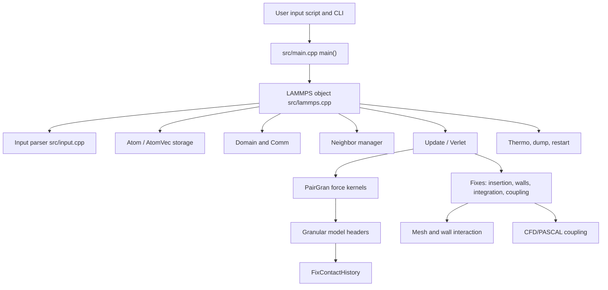

# LIGGGHTS Architecture Overview

## Evidence scope

This report evaluates the source snapshot under `LIGGGHTS-PUBLIC-master/`. A local `git status` check found no `.git` metadata in the snapshot, so commit ancestry and branch state could not be verified locally. The repository contains source, generated documentation, examples, optional libraries, and make/CMake files. No production source files were changed.

The local toolchain check found no `cmake`, `make`, `mingw32-make`, `g++`, `cl`, or `mpiexec` on `PATH`. Therefore architecture conclusions are verified by code inspection, and runtime profiling is deferred to the benchmark protocol.

## Module diagram

The standalone Mermaid source is in `architecture_diagram.mmd`.

## Programming model and build system

| Area | Evidence | Assessment |
| --- | --- | --- |
| Primary language | `src/` contains hundreds of C++ `.cpp` and `.h` files; `src/main.cpp:73-103` is the executable entry point. | Mature LAMMPS-derived C++ codebase with template-heavy granular model headers. |
| Optional/legacy languages | `python/`, `lib/cuda`, `lib/gpu`, and several Fortran-oriented library makefiles under `lib/meam`, `lib/reax`, and `lib/linalg`. | Broad legacy ecosystem; dependency surfaces need modernization. |
| CMake | `src/CMakeLists.txt:1-12` requires CMake 2.8 and sets GNU flags including `-O2`, `-funroll-loops`, `-fstrict-aliasing`, and `-std=c++11`. | CMake is old and target modeling is minimal. |
| Make | `src/MAKE/Makefile.mpi:9-22` uses `mpic++`; `src/MAKE/Makefile.serial:1-42` builds against MPI stubs. | Traditional LAMMPS-style build remains primary for many users. |
| MPI | `src/CMakeLists.txt:94-119` enables MPI when found and otherwise links `STUBS`; `doc/Section_start.txt:510-548` documents MPI and serial stub use. | MPI is central, with serial fallback. |
| Optional VTK/JPEG | `src/CMakeLists.txt:65-90` gates VTK/JPEG. | Useful output support, but dependency discovery is dated. |
| Windows support | `src/CMakeLists.txt:29-32` requires Cygwin for generated headers on Windows. | Native Windows developer experience is weak. |
| GPU/OpenMP | `src/lammps.cpp:612-616` selects CUDA comm/neighbor objects when enabled; `src/update.cpp:97-103` selects `verlet/cuda`; `src/accelerator_omp.h:48-89` declares OpenMP neighbor variants. | Optional acceleration infrastructure exists, but this evaluation did not confirm a current broad granular GPU path by build/run. |
| Tests/CI | Repository sweep found examples and makefiles but no visible CI, CTest, or regression harness. | Regression quality is a major risk. |

## Main execution flow

1. **Initialization:** `src/main.cpp:73-103` installs signal handlers, calls `MPI_Init`, constructs `LAMMPS`, runs the input file, deletes the object, and calls `MPI_Finalize`.
2. **Command-line parsing:** `src/lammps.cpp:138-271` parses switches such as `-partition`, `-in`, `-screen`, `-log`, `-cuda`, `-domain`, `-suffix`, and `-restart`.
3. **Core object graph:** `src/lammps.cpp:607-650` creates `Comm`, `Neighbor`, `Domain`, `Atom`, `Group`, `Force`, `Modify`, `Output`, `Update`, and `Timer`.
4. **Input parsing:** `src/input.cpp:183-260` reads input lines on rank 0, broadcasts them, parses, and dispatches commands; `src/input.cpp:343-370` strips comments, handles quotes, and substitutes variables.
5. **Run command:** `src/run.cpp:81-229` parses run arguments, initializes the simulation, calls `update->integrate->setup()`, runs the integrator, and prints finish statistics.
6. **Time stepping:** `src/verlet.cpp:264-388` is the central timestep loop: fix initial integration, neighbor rebuild decision, communication/exchange or forward ghost communication, force clearing, pair/bond/kspace force computation, reverse communication, final integration, fix callbacks, and output.
7. **Neighbor rebuilds:** `src/neighbor.cpp:1357-1460` decides rebuilds based on delay/every, displacement checks, radius changes, and an `MPI_Allreduce`; `src/neighbor.cpp:1469-1562` builds requested lists.
8. **Force calculation:** `src/pair_gran_base.h:187-430` templates the granular pair-force loop over neighbor lists and model chains.
9. **Restart/output:** `src/write_restart.cpp:229-394` supports single-file root-gathered restart or one-file-per-rank restart when `%` appears in the filename.

## Core source ownership

| Module | Main files/classes | Responsibility | Performance sensitivity | Technical debt/risk |
| --- | --- | --- | --- | --- |
| Particle data storage | `src/atom.h`, `src/atom.cpp`, `src/atom_vec.h`, `src/atom_vec_sphere.cpp`, `src/atom_vec_superquadric.cpp` | Owns per-atom arrays, atom styles, exchange/restart packing, maps, and extra per-style properties. | Very high: every force, integration, communication, and output path touches these arrays. | Pointer-based `double **` arrays (`src/atom.h:81-88`) hinder flat SIMD/AoSoA access; ownership predates modern RAII. |
| Contact history | `src/fix_contact_history.*`, `src/pair_gran.*`, `src/neigh_gran.cpp` | Stores tangential/rolling/cohesive history values and migrates them across neighbor rebuilds. | Very high for history contact models and dense flows. | History migration uses page chunks and per-partner scans (`src/fix_contact_history.cpp:305-425`, `src/neigh_gran.cpp:485-639`). |
| Neighbor lists/contact detection | `src/neighbor.*`, `src/neigh_list.h`, `src/neigh_request.h`, `src/neigh_gran.cpp`, `src/neigh_stencil.cpp` | Manages nsq/bin/multi neighbor styles, bins, stencils, skin, rebuild checks, and granular history neighbor lists. | Dominant for dense or polydisperse systems. | Granular `multi` is restricted/not generally enabled (`src/neighbor.cpp:1184-1193`, `src/neighbor.cpp:1272-1279`); history lookup is linear in partner count. |
| Contact-force models | `src/pair_gran.*`, `src/pair_gran_proxy.cpp`, `src/pair_gran_base.h`, `normal_model_*.h`, `tangential_model_*.h`, `rolling_model_*.h`, `cohesion_model_*.h`, `surface_model_*.h` | Implements granular normal, tangential, rolling, cohesion, and surface interaction models. | Highest per-step arithmetic hotspot. | Branch-heavy per-contact path and repeated `sqrt`, property loads, pointer chasing; history forces require `newton pair off` (`src/pair_gran.cpp:256-261`). |
| Integration/time stepping | `src/update.cpp`, `src/verlet.cpp`, `src/fix_nve_sphere.cpp`, `src/fix_nve_asphere_base.cpp` | Selects integrator, manages timestep loop, and integrates translational/rotational motion. | High. | `src/fix_nve_asphere_base.cpp:225-315` has a scheme-4 null-pointer risk when implicit CFD coupling data are absent. |
| MPI communication | `src/comm.*`, `src/irregular.*`, `src/procmap.*` | Exchanges migrating atoms, ghost borders, forward/reverse data, and irregular migration. | Very high at scale and high surface/volume partitions. | Uses posted receives plus blocking sends and several hot-path collectives (`src/comm.cpp:901-1229`, `src/irregular.cpp:283-421`). |
| Domain decomposition and load balancing | `src/domain.*`, `src/comm.*`, `doc/processors.txt` | Defines global/local boxes, processor grid, and spatial partitions. | High for heterogeneous particle distributions. | Public documentation states no on-the-fly load balancing (`doc/processors.txt:68-69`); `src/comm.cpp:219-344` initializes mostly static split arrays. |
| I/O, restart, post-processing | `src/output.*`, `src/dump_*.cpp`, `src/write_restart.cpp`, `src/read_restart.cpp`, docs for dump/restart | Thermo output, text/VTK dumps, restart read/write. | High for large production runs and visualization-heavy workflows. | Single-file restart is root-centric; `%` mode is file-per-rank rather than self-describing parallel I/O (`src/write_restart.cpp:229-394`). |
| Mesh/wall interaction | `src/fix_mesh_surface.*`, `src/fix_wall_gran.*`, `src/tri_mesh.*`, `src/surface_mesh*`, `src/mesh_module_*`, `src/surface_model_*` | Imports/manages triangular meshes and wall contacts, including moving mesh examples. | High in equipment simulations with many wall contacts. | Mesh contact adds geometry-specific branches and broad data access; superquadric wall contact is especially expensive. |
| Coupling interfaces | `src/fix_cfd_coupling*`, `src/cfd_datacoupling_*`, `src/PASCAL/fix_pascal_couple.*`, `doc/fix_couple_cfd.txt` | CFD-DEM, force, thermal/species hooks, and ParScale/PASCAL coupling. | High when coupled, especially communication and external array mapping. | `src/cfd_datacoupling_mpi.cpp:120-190` allocates by `atom->tag_max()`, which can be memory-fragile for sparse tags. |

## Architecture strengths

- Verified by code inspection: the code has a clean high-level LAMMPS-style object graph, mature input compatibility, modular pair/fix/dump/atom styles, and extensive granular model families.
- Verified by code inspection: benchmarkable examples cover sphere, multisphere, cohesion, hysteresis, heat transfer, mesh walls, superquadrics, SPH, and coupling cases.
- Verified by code inspection: template-based granular model composition allows compile-time model paths once a `pair_style gran ...` combination is selected.

## Architecture risks

- Verified by code inspection: the hottest data structures are still legacy pointer arrays and page allocators, which complicate vectorization, GPU portability, and memory ownership reasoning.
- Verified by code inspection: the public build and docs are inconsistent in places. For example, `doc/atom_style.txt:31-32` says superquadric is not available in the public version, while source and examples include `atom_style superquadric` and `surface_model_superquadric` (`examples/LIGGGHTS/Tutorials_public/superquadric/in.particle_particle:8`).
- Hypothesis requiring benchmark validation: the combination of static decomposition, `newton pair off` for shear history, and linear history lookup is likely the main multi-node scaling ceiling for dense granular runs.
